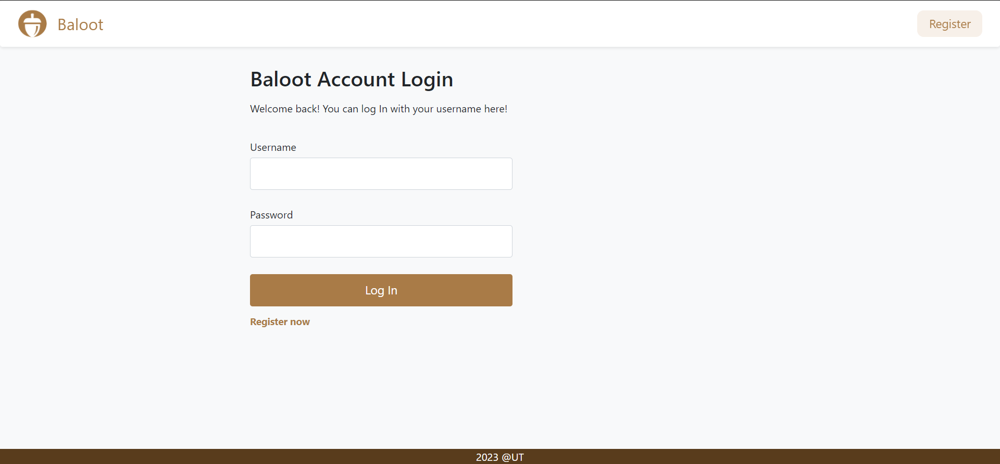
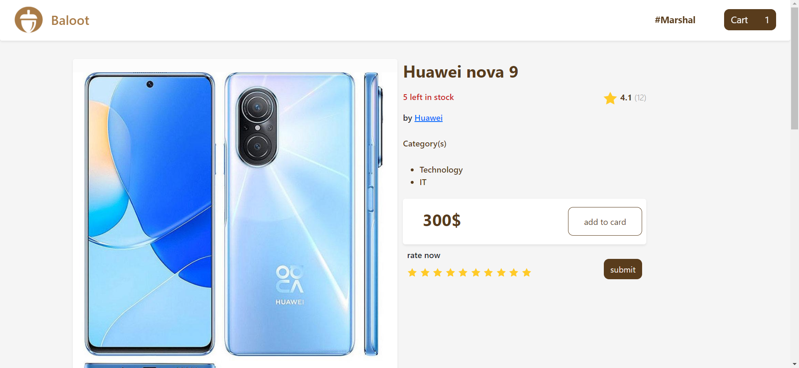
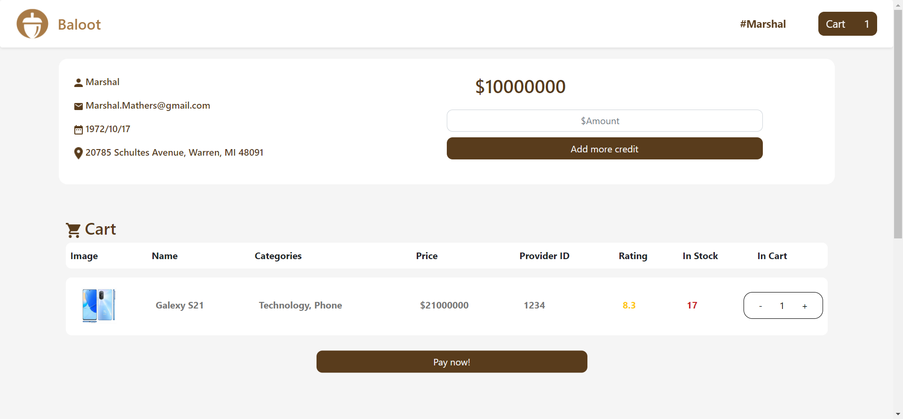

# Internet-Engineering-Course-Projects
This repository hosts the complete source code for the Spring 2023 Internet Engineering course project at the University of Tehran. We built an e-commerce online shop from scratch, employing the following tech stack in the final phase:

* #### Backend development: Java + Spring framework
* #### Frontend development: React + Bootstrap
* #### Database: MySQL RDBMS
* #### Deployment: Docker + Nginx
 

## Developement

The project progressed through multiple phases, each focusing on specific aspects:

### CA-1: Maven, JSON, Unit testing using JUnit
### CA-2: Basic Server Development with Javalin
### CA-3: Apache Tomcat, Servlets, JSP Template Engine, MVC Pattern
### CA-4: HTML, CSS, Bootstrap
### CA-5: Spring, React, REST API, CORS Handling
### CA-6: JDBC, MySQL RDBMS
### CA-7: JWT Authentication, SQL Injection Prevention
### CA-8: Docker, Nginx
 

## System Description

The system developed in this course is named Baloot, an online e-commerce shop that requires user registration to access its features. Users can perform various tasks, including:

* #### Adding to their account balance
* #### Purchasing products
* #### Rating products
* #### Managing their buylist by adding or removing items
* #### Posting comments on products, and liking/disliking them
 

## Pictures

